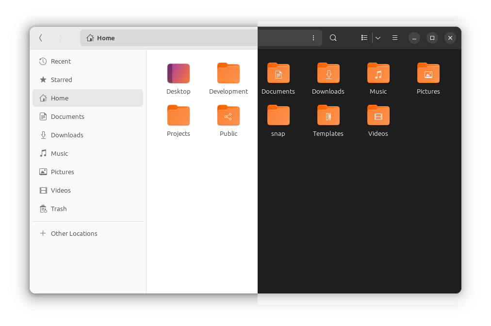

# yuru 

The default grey Yaru folders felt a little drab and as I wanted a little bit of playfulness to my desktop, I recolored them to a colorpicked `#fc9654` from Suru

This icon theme is named `Yuru` after [yaru](https://github.com/ubuntu/yaru), the current default icon theme, and [suru](https://github.com/snwh/suru-icon-theme), which sported vibrant, colorful, lively icons and was once the accompanying icon theme to an older version of the yaru gtk theme.

This icon theme appears to work in both light & dark mode 

Made with love on Ubuntu MATE 23.04 :heart:

This project is not to be confused with yuru-mate-icons

## preview - Yuru (split screen)

## usage 

* You can either `git clone` this repository, or download the zip file in the `Releases` tab

* Check to see if the `~/.local/share/icons` folder exists in your system - if it doesn't you can create it yourself by running `mkdir -p ~/.local/share/icons`

* place the `Yuru` folder in `~/.local/share/icons` or `/usr/share/icons`

* Open `Tweaks` - you'll need to install `gnome-tweaks` as per your distribution

### important usage note

Note that you need to keep both variants around as `Yaru MATE Dark`, and consequently `Yuru-MATE-dark` inherit icons from the light variant! 

## license 

Since this is the Yaru icon set with recolored folders from suru, it ships under the same licenses as Yaru, and Suru

